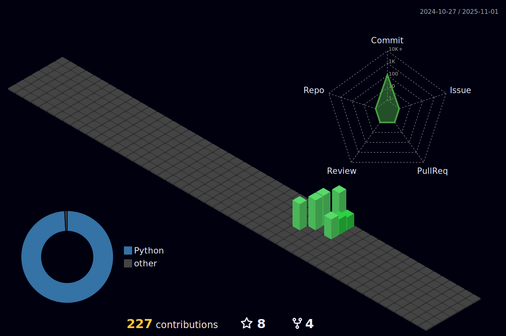

<h1 align="center">Hi 👋 I'm Ayush Kumar Gupta</h1>
<h3 align="center">विकास महत्वपूर्ण है</h3>

  

- 🔭 I’m currently working on My own portfolio

- 🌱 I’m currently learning **Swift,Android Development,FrontEnd Development**

- 🙋‍♂️🙇‍♂️ I’m looking to collaborate with **Learners to Develop Something**

- 🤝 I’m looking for help with **React js**

- 👨‍💻 All of my projects are available at [Portfolio](https://ayushkr.vercel.app/)

- 💬 Ask me about **Python, C++,UI/UX design, Sports⚽🏀**

- 📫 How to reach me **ayushgupta220305@gmail.com**

- ⚡ Fun fact **I don't like to sit idle 😃**

- 
  

 

<h3 align="left">Connect with me:</h3>

 

<h3 align="left">Languages and Tools:</h3>

                

&nbsp;

